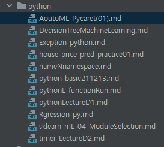

# python_std

2021.12

---

big data 과정중 python basic lecture 에대한 것을 upload

1. PyThon_function
    - python 함수, class 에  대한 내용
2. python_ml_
   - python machine Leaning에 대한 내용
   
관련하여 blog글로 보고 싶다면, 

[python_basic_Bank](https://yoonhwa-p.github.io/2021/12/13/python/python_basic211213/)

이곳에서 더 찾아 보면 된다. 